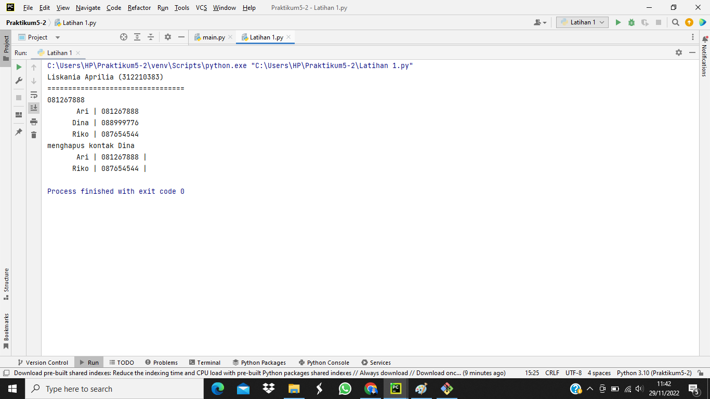

# Latihan-1 

# Penjelasan Program

1. Buat Dictionary daftar kontak
2. Tampilkan kontaknya Ari
3. Tambah kontak baru dengan nama Riko, nomro 087654544
4. Ubah kontak dina dengan nomor baru 088999776
5. Tampilkan semua Nama
6. Tampilkan semua Nomor
7. Tampilkan daftar Nama dan nomronya
8. Hapus kontak Dina

- Program 

- Hasil dari program

# Praktikum 

# Penjelasan Program

1. data = {}, adalah sebuah variabel bertipe dictionary Kosong / tidak bervalue, ini berfungsi untuk menampung inputan kyboard/user.

2. while True:, adalah sebuah perulangan while, yang akan terus mengulang karna nilai nya True dan nanti akan berhenti dengan perintah break

3. print(), artinya output kosong untuk membuat jarak antara outputan lain.

4. lanjut = str(input('(L)ihat, (T)ambah, (U)bah, (H)apus, (C)ari, (K)eluar: ')), artinya sebuah variabel bernama/inisial 'lanjut' yang di inputkan data bertipe string dengan tampilan input (L)ihat, (T)ambah, (U)bah, (H)apus, (C)ari, (K)eluar:.

- if lanjut.lower() == 't':
- print('Tambah Data')
- nama = str(input('Nama\t\t: '))
- nim = str(input('NIM\t\t: '))
- uts = int(input('Nilai UTS\t: '))
- uas = int(input('Nilai UAS\t: '))
- tugas = int(input('Nilai Tugas\t: '))
- akhir = round(float((tugas*0.3)+(uts*0.35)+(uas*0.35)),2)
- data[nama]=nim, uts, uas, tugas, akhir

5. perintah lower() memiliki arti yakni untuk membuat semua yang di inputkan menjadi huruf kecil,dan (\t) adalah tab berfungsi untuk mengatur jarak spasi, jadi arti keseluruhan nya yakni jika variabel *inputan pada varibel lanjut.lower() seperti 't' maka tampilkan Tambah Data, input nama bertipe data string Nama: , input nim bertipe data string NIM: , input uts bertipe data integer Nilai UTS: , input UAS bertipe data integer Nilai UAS: , input tugas bertipe data integer Nilai Tugas: . Pada varibel akhir menggunakan operator aritmatika dan bertipe data float, dan juga memiliki perintah round(,2) yang memiliki arti yakni untuk mengambil angka dibelakang koma sebanyak yang kita inginkan disana saya hanya menginginkan 2 angka di belakang koma, terakhir kita juga memasukan inputan tadi kedalam data[nama] agar nanti masuk kedalam data = {} atau dictionary kosong yang tadi dibuat.

6. elif lanjut.lower() == 'l':, artinya jika variabel inputan pada varibel 'lanjut'.lower() seperti 'l' maka.....*

- if data.items():
- print('Daftar Nilai')
- print('='*84)
- print(f"|{'NO':^4}|{'NAMA':^20}|{'NIM':^20}|{'TUGAS':^10}|{'UTS':^6}|{'UAS':^6}|{'AKHIR':^10}|")
- print('='*84)
- n = 0
- for a in data.items():
- n += 1
- print("|{no:^4}|{0:^20}|{1:^20}|{2:^10}|{3:^6}|{4:^6}|{5:^10}|"
- .format(a[0][:13], a[1][0], a[1][1], a[1][2], a[1][3], a[1][4], no = n))
- print('='*84)

7. perintah items() berfungsi untuk mengembalikan daftar yang berisi tuple untuk setiap pasangan nilai keys, ini berarti jika didalam items data dictionary ada sebuah data maka tampilkan : 'Daftar Nilai', '='sebanyak 84 kali, (^)artinya untuk memposisikan ditengah, format NO-NAMA-NIM-TUGAS-UTS-UAS-AKHIR untuk angka pada format yakni posisi tampilannya. input varibel n berfungsi untuk outputan nomor nanti. perulangan for variabel 'a' di dalam data.items(): didalam proses perulangan ini pada variabel n akan ada proses assigment tambah 1, lalu output menggunakan format seperti sebelumnya tetapi di format ke(aindex ke-0, adimensi ke-1 index ke-0,adimensi ke-1 index ke-1, adimensi ke-1 index ke-2, adimensi ke-1 index ke-3, adimensi ke-1 index ke-4, dan no sama dengan n)

- else:
- print('Daftar Nilai')
- print('='*84)
- print(f"|{'NO':^4}|{'NAMA':^20}|{'NIM':^20}|{'TUGAS':^10}|{'UTS':^6}|{'UAS':^6}|{'AKHIR':^10}|")
- print('='*84)
- print(f"|{'TIDAK ADA DATA':^82}|")
- print('='*84)

8. artinya jika didalam items data dictionary ada sebuah data maka tampilkan: 'Daftar Nilai', '='sebanyak 84 kali, (^)artinya untuk memposisikan ditengah, format NO-NAMA-NIM-TUGAS-UTS-UAS-AKHIR untuk angka pada format yakni posisi tampilan nya. Print atau tampilkan menggunakan format 'TIDAK ADA DATA' : letaknya ditengah pada jarak 84.

- elif lanjut.lower() == 'u':
- print("Ubah Data")
- nama = str(input('Nama\t\t: '))

8. artinya jika variabel inputan pada varibel 'lanjut'.lower() seperti 'u' maka tampilkan 'Ubah Data' dan juga input pada variabel nama bertipe data string,

- if nama in data.keys():
- nim = str(input('NIM\t\t: '))
- uts = int(input('Nilai UTS\t: '))
- uas = int(input('Nilai UAS\t: '))
- tugas = int(input('Nilai Tugas\t: '))
- akhir = round(float((tugas*0.3)+(uts*0.35)+(uas*0.35)),2)
- data[nama] = nim, uts, uas, tugas, akhir

9. artinya jika inputan pada variabel nama sebelumnya ada di dalam data.keys() maka input variabel nim bertipe data string, uts, uas, tugas bertipe data integer dan akhir bertipe data float yang di kasih perintah round() sebelumnya sudah dibahas arti dari perintah tersebut, lalu kita inputkan pada data dictionary agar nanti data pada datadictionary berganti/terubah.

- else:
- print(f"Nama {nama} Tidak Tersedia")

10. artinya jika inputan pada variabel nama tidak ada dalam data.keys maka tampilkan Nama tidak tersedia menggunakan format (nama).

- elif lanjut.lower() == 'h':
- print('Hapus Data')
- nama = str(input('Nama\t\t: '))

11. artinya jika variabel inputan pada varibel 'lanjut'.lower() seperti 'h' maka tampilkan 'Hapus Data' dan juga input pada variabel nama bertipe data string,

- if nama in data.keys():
- del data[nama]

12. artinya jika inputan pada variabel nama sebelumnya ada di dalam data.keys() maka gunakan perintah menghapus data pada dictionary data[nama].

- else:
- print(f"Nama {nama} Tidak Tersedia")

13. artinya jika inputan pada variabel nama tidak ada dalam data.keys maka tampilkan Nama tidak tersedia menggunakan format (nama).

- elif lanjut.lower() == 'c':
- print('Data Cari')
- nama = str(input('Nama\t\t: '))

14. artinya jika variabel inputan pada varibel 'lanjut'.lower() seperti 'h' maka tampilkan 'Data Cari' dan juga input pada variabel nama bertipe data string,

- if nama in data.keys():
- print('='*79)
- print(f"|{'NAMA':^20}|{'NIM':^20}|{'TUGAS':^10}|{'UTS':^6}|{'UAS':^6}|{'AKHIR':^10}|")
- print('='*79)
- print("|{0:^20}|{1:^20}|{2:^10}|{3:^6}|{4:^6}|{5:^10}|"
- .format(nama, nim, tugas, uts, uas, akhir))
- print('='*79)

15. artinya jika inputan pada variabel nama sebelumnya ada di dalam data.keys() maka tampilkan : 'Cari Data', '='sebanyak 79 kali, (^)artinya untuk memposisikan ditengah, format NO-NAMA-NIM-TUGAS-UTS-UAS-AKHIR, untuk angka pada format yakni posisi tampilannya.

- else:
- print(f"Nama {nama} Tidak Tersedia")

16. artinya jika inputan pada variabel nama tidak ada dalam data.keys maka tampilkan Nama tidak tersedia menggunakan format (nama).

- elif lanjut.lower() == 'k':
- print('Selesai')
- break

17. artinya jika variabel inputan pada varibel 'lanjut'.lower() seperti selain dari yang tersedia maka tampilkan 'Selesai' dan program pun berakhir.

- else:
- print('Pilih tindakan yang tersedia')

18. artinya jika variabel inputan pada varibel 'lanjut'.lower() seperti selain dari yang tersedia maka tampilkan 'Pilih tindakan yang tersedia

- Program

- Hasil dari Program

- Flowchart

